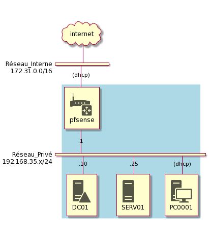

*420-3A5-EM Automatisation de tâches (H2021)*
# Travail pratique #2<!-- omit in toc --> 

Ce TP est à faire individuellement. Il compte pour 30% de la note du cours.

## Table des matières<!-- omit in toc --> 
- [1. Mandat](#1-mandat)
- [2. Préparation](#2-préparation)
- [3. Scripts à développer](#3-scripts-à-développer)
  - [3.1. LogonScript.ps1](#31-logonscriptps1)
  - [3.2. Install-LogonScript.ps1](#32-install-logonscriptps1)
- [4. Conception et style](#4-conception-et-style)
- [5. Plan de test](#5-plan-de-test)
- [6. Remise](#6-remise)
- [7. Critères d'évaluation](#7-critères-dévaluation)
- [8. Conseils et mises en garde](#8-conseils-et-mises-en-garde)


## 1. Mandat

Votre patron vous demande de faire en sorte que chaque fois qu’un utilisateur démarre une session sur une machine du domaine, certaines configurations soient appliquées automatiquement à ce profil utilisateur. On appelle ce type de script un *Logon Script*.

Vous savez déjà comment lancer un script automatiquement au démarrage d’une session, vous l’avez vu dans votre cours de *Systèmes d’exploitation*. Mais vous ne voulez pas devoir programmer chaque machine pour que le script doit s’exécuté au démarrage. Alors, vous envisagez de créer un autre script, que vous lancerez avec vos privilèges d’administrateur, qui installera ce script de logon sur plusieurs machines à la fois. 

Ce script de déploiement devra se connecter par WinRM sur chaque machine spécifiée dans un fichier d’entrée, copier le script de logon sur la machine et programmer son exécution au démarrage.


## 2. Préparation

Pour ce TP, il vous faut un environnement de machines virtuelles composé minimalement de :
- Un contrôleur de domaine Windows Server 2019 (*DC01*)
- Un serveur Windows Server 2019, membre du domaine (*SERV01*)
- Un client Windows 10, membre du domaine (*PC0001*)
- Un routeur virtuel pfSense (*PFSENSE*)

\
*Fig. 1 - Diagramme du réseau*

Votre environnement doit posséder trois partages de fichiers, hébergés par le **serveur membre** (***PAS*** le contrôleur de domaine!).

| Chemin UNC                | Accès                                                          |
| ------------------------- | -------------------------------------------------------------- |
| \\\\SERV01\\Commun        | Tous les utilisateurs du domaine ont un accès complet          |
| \\\\SERV01\\Applications$ | Tous les utilisateurs du domaine ont un accès en lecture seule |
| \\\\SERV01\\Logs$         | Tous les utilisateurs du domaine ont un accès complet          |


Toutes les machines doivent avoir été préparées pour pouvoir être administrées via **WinRM** ainsi que **WMI**. Elles doivent aussi être configurées pour que la **politique d’exécution** de PowerShell soit en mode **RemoteSigned**.


## 3. Scripts à développer

Vous devez développer deux scripts : 
  - Un **script de logon**, qui devra être lancé automatiquement à chaque démarrage de session
  - Un **script de déploiement**, qui sera lancé une fois par l'administrateur et configurera le script de logon sur plusieurs machines du réseau


### 3.1. LogonScript.ps1

Le script de logon doit être exécuté automatiquement à chaque démarrage d’une session utilisateur. La manière dont ce script est exécuté vous appartient (clé *Run* dans le registre, tâches planifiées, etc.). Il doit être exécuté automatiquement **peu importe l’utilisateur** qui se logue sur la machine. **Ce script ne doit pas nécessiter de droits d’administration**.

Le script doit s’assurer des choses suivantes :
- Mapper le lecteur réseau **Z:\\** vers un partage réseau **\\\\serveur\\commun\\** que vous avez préalablement créé sur votre serveur Windows.
- Installer [Visual Studio Code](https://code.visualstudio.com/sha/download?build=stable&os=win32-x64-user).[^vscode]
- Déposer un **raccourci** de VS Code sur le bureau
- Écrire une ligne dans le fichier **\\\\serveur\\log$\\logon_*hostname*.log** , où *hostname* représente le nom de la machine. Cette ligne dans le fichier doit montrer le nom de l’utilisateur ainsi que la date et l’heure où la connexion a eu lieu.
- Copier l’outil [*BGInfo*](https://docs.microsoft.com/en-us/sysinternals/downloads/bginfo) du répertoire **\\\\serveur\\application$** dans le répertoire correspondant à la variable d’environnement *APPDATA*.
- Lancer l’outil *BGInfo* de sorte qu’il s’applique de manière silencieuse.
- Tenir un journal horodaté et cumulatif des actions importantes du script au fur et à mesure de son exécution, sur le disque local, dans le répertoire correspondant à la variable d’environnement *APPDATA*.
- En cas d’échec, afficher une boîte de dialogue à l’écran[^dialogue].


### 3.2. Install-LogonScript.ps1

Le script de déploiement est lancé par un administrateur de domaine. Il doit faire les choses suivantes :
- Prendre en paramètre un fichier texte dont chaque ligne correspond à une machine de votre réseau.
- Pour chaque machine dans le fichier : 
  - Uploader le fichier **LogonScript.ps1** dans le répertoire **C:\\ProgramData\\Scripts\\** (créer le répertoire si nécessaire)
  - Vérifier si le script est déjà planifié, et si non, faire le nécessaire pour que ce script doit être appelé automatiquement au logon d’un utilisateur[^planif].
- Ce script doit envoyer des commandes aux machines distantes via *WinRM*, et non être exécuté sur les machines distantes.
- Tenir un journal horodaté et cumulatif des actions importantes du script au fur et à mesure de son exécution, sur le disque local, dans le répertoire correspondant à la variable d’environnement *APPDATA*.
- Implémentation du mode Verbose pour plus de détails sur le déroulement


## 4. Conception et style

Vos scripts doivent autant que possible se coller à de bonnes pratiques de programmation: 
  - Code bien indenté
  - Commentaires appropriés
  - Bonne logique
  - Validation des paramètres
  - Vérifications
  - Gestion des erreurs
  - *etc.*


## 5. Plan de test

Vous devez accompagner votre script d’un document détaillant quels tests devront être effectués pour valider le fonctionnement de votre script. Dans ce document, expliquez les vérifications que vous faites lorsque vous testez votre script.

Imaginez que ce document est destiné aux employés du département d’assurance-qualité qui doit valider que vos scripts sont prêts pour être déployés en production.

> Conseil: Établissez votre plan de test avant de commencer à coder. Ça vous aidera à tester vos scripts en cours de développement.


## 6. Remise

La remise de ce travail se fait par GitHub Classroom. Pour déposer votre travail dans GitHub, vous devez faire un Git Commit suivi d'un Git Push. Vous pouvez faire cette opération autant de fois que vous le voulez, mais il faut vous assurer que la version finale de votre travail soit intégralement poussée dans GitHub avant la date butoir.


## 7. Critères d'évaluation

| Critère                 | Description                                              |      |
| :---------------------- | :------------------------------------------------------- | ---: |
| LogonScript.ps1         | Fonctionnalités du script                                | / 30 |
| Install-LogonScript.ps1 | Fonctionnalités du script                                | / 30 |
| Conception et style     | Logique, gestion d’erreurs, lisibilité, bonnes pratiques | / 20 |
| Plan de test            | Tests pertinents, bien identifiés                        | / 20 |


## 8. Conseils et mises en garde

Ce TP demande de la débrouillardise, de la rigueur et de la discipline. Certaines demandes n'ont pas été couvertes directement dans les notes de cours et les prestations, mais vous devriez avoir toutes les notions pour trouver comment y répondre avec quelques recherches sur Internet. 

Ne tombez pas dans le piège d'essayer de tout faire d'un coup. Un projet comme celui-ci peut sembler imposant, mais sera beaucoup plus simple si vous le séparez en plusieurs petits problèmes. Par exemple, démarrez votre script avec du pseudo-code en commentaires, en détaillant chaque petite étape ainsi que son résultat. N'hésitez pas à faire des fonctions pour factoriser le code redondant ou pour isoler dans une "boîte noire" les parties les plus complexes de votre code. Si votre code se décliner en une succession de petites étapes simples, vous verrez que ce projet sera beaucoup plus simple réussir.

Comme à l'habitude, vous êtes fortement encouragés à poser vos questions **sans attendre** dans le canal Questions, sur Teams.


[^vscode]: Puisque le script ne sera pas exécuté avec des droits admin, il faut sélectionner l'installation usager et non l'installation système. VS Code sera ainsi installé dans le profil de l'utilisateur, et ne nécessitera pas de droits admin.

[^dialogue]: Voici comment afficher une boîte de dialogue à l'écran:

    ``` powershell
    Add-Type -AssemblyName PresentationCore,PresentationFramework
    [System.Windows.MessageBox]::Show("Message","Titre","OK","Error")
    ```

[^planif]: Cela peut se faire par la méthode de votre choix:

    - Par le planificateur de tâches
    - Par la clé Run dans le registre
    - Par le menu Démarrer

